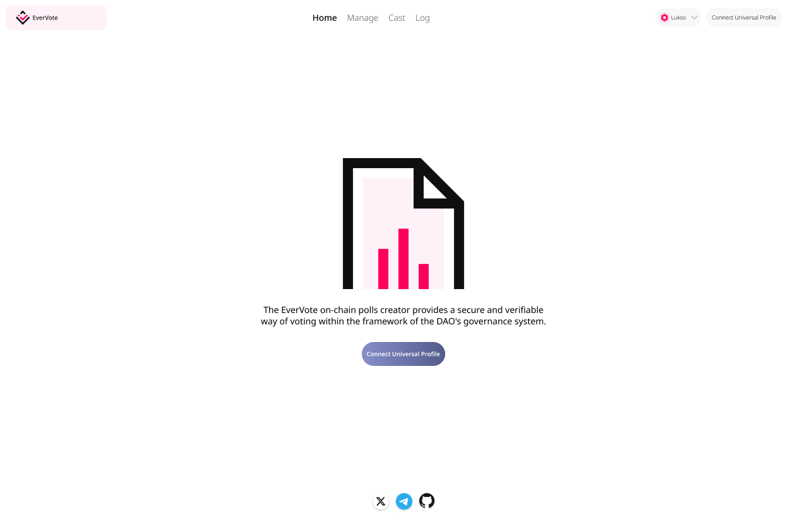
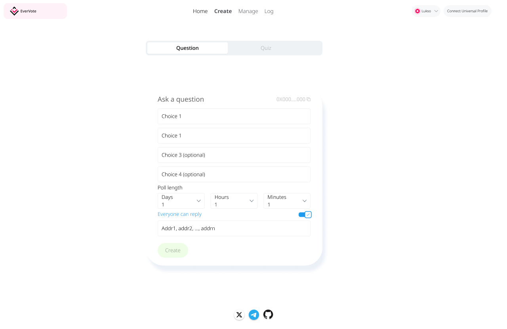

# Evervote with 🆙

Evernote provides a platform for its users to create polls and vote on them through a blockchain-based decentralized autonomous organization (DAO).

## UI/UX



## Overview

An allowlist for NFTs is essentially a roster of wallet addresses that are granted the privilege of minting NFTs before a general release of a collection. There are several means of being added to an allowlist, but the primary one is engaging in an NFT project's community.

This smart contract provides a secure and transparent way to manage whitelist access for minting NFTs.

### Advantages

- **Enhanced Security:** 

Immutability: Data stored on the blockchain is tamper-proof, meaning once recorded, it cannot be altered or deleted. This helps prevent vote manipulation and fraud.

Decentralization: The distributed ledger technology eliminates the need for a central authority to control the voting process, making it less vulnerable to hacking or manipulation by a single entity.

- **Increased Transparency and Trust:** 

Transparency: All vote transactions are publicly visible on the blockchain, allowing anyone to verify the integrity of the process and the results. This fosters increased trust and confidence in the outcome of the poll.

Auditability: The immutable nature of the blockchain allows for easy auditing of the voting process and identification of any potential irregularities.

- **Improved Accessibility and Efficiency:** 

Remote Voting: Blockchain-based polling can enable secure and convenient remote voting, making it easier for people who cannot physically attend polling stations to participate.

Reduced Costs: By eliminating the need for physical polling stations and paper ballots, blockchain-based polls can potentially reduce the overall costs associated with conducting elections.


### Access Control

- Owner of the contract is not able to do CUD (create, update, and delete)
- Owner of the contract is not able to pause the poll

### Motiviation

> On LUKSO, users currently get a free monthly quota of 20.000.000 GAS when creating a Universal Profile through the Universal Profile Browser Extension[1].

### Getting Started

```
git clone [Repo URL]
cd whitelistfactory
npm run test
```

➜ Booom💥

### Deployed Contract (Testnet)

Sepolia: contract address `0x48b7720547c11251a8abe5a1c7d0c791500f5a3b` [view on explorer](https://sepolia.etherscan.io/address/0x48b7720547c11251a8abe5a1c7d0c791500f5a3b)

We will be adding more networks soon.


### Contributing

Pull requests are welcome. For major changes, please open an issue first to discuss what you would like to change.

Please make sure to update tests as appropriate.

### ToDo


### Reference

 - [1] [Lukso](https://docs.lukso.tech/learn/concepts/#transaction-relay-service:~:text=On%20LUKSO%2C%20users%20currently%20get%20a%20free%20monthly%20quota%20of%2020.000.000%20GAS%20when%20creating%20a%20Universal%20Profile%20through%20the%20Universal%20Profile%20Browser%20Extension.)

## License

Distributed under the [MIT](https://choosealicense.com/licenses/mit/) License.
